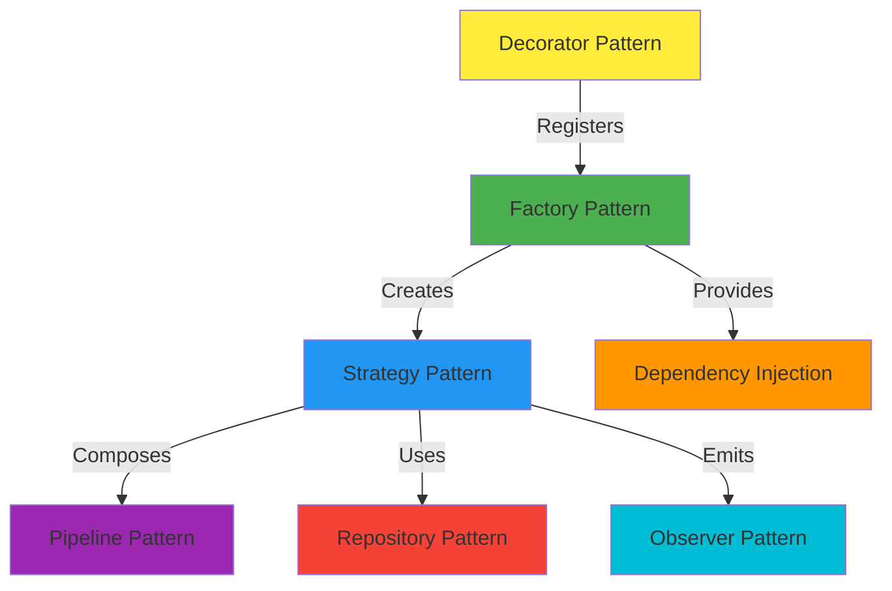

# Design Patterns

RAG Factory leverages several well-established design patterns to provide a flexible, maintainable architecture.

---

## Factory Pattern

The **Factory Pattern** is the core of RAG Factory, providing centralized strategy creation and management.

### Implementation

```python
class RAGFactory:
    """Factory for creating RAG strategy instances."""
    
    _registry: Dict[str, Type[IRAGStrategy]] = {}
    
    @classmethod
    def register_strategy(cls, name: str, strategy_class: Type[IRAGStrategy]):
        """Register a strategy class."""
        cls._registry[name] = strategy_class
    
    @classmethod
    def create_strategy(cls, name: str, config: Dict) -> IRAGStrategy:
        """Create and initialize a strategy instance."""
        if name not in cls._registry:
            raise StrategyNotFoundError(f"Strategy '{name}' not found")
        
        strategy_class = cls._registry[name]
        return strategy_class(config)
```

### Benefits

- **Centralized Creation**: Single point for strategy instantiation
- **Loose Coupling**: Clients don't need to know concrete strategy classes
- **Easy Extension**: New strategies can be added without modifying client code
- **Configuration-Driven**: Strategies can be created from configuration files

### Usage Example

```python
from rag_factory.factory import RAGFactory

# Register strategies (usually done at module import)
factory = RAGFactory()
factory.register_strategy("contextual", ContextualRetrievalStrategy)

# Create strategy from configuration
config = {"chunk_size": 512, "top_k": 5}
strategy = factory.create_strategy("contextual", config)

# Or from file
strategy = factory.create_from_config("config.yaml")
```

---

## Strategy Pattern

The **Strategy Pattern** allows different retrieval algorithms to be used interchangeably.

### Interface Definition

```python
from abc import ABC, abstractmethod
from typing import List

class IRAGStrategy(ABC):
    """Interface for RAG strategies."""
    
    @abstractmethod
    def retrieve(self, query: str, **kwargs) -> List[RetrievalResult]:
        """Retrieve relevant documents for a query."""
        pass
    
    @abstractmethod
    def initialize(self, config: StrategyConfig) -> None:
        """Initialize the strategy with configuration."""
        pass
```

### Concrete Strategies

```python
class ContextualRetrievalStrategy(IRAGStrategy):
    """Contextual retrieval strategy implementation."""
    
    def retrieve(self, query: str, **kwargs):
        # Contextual retrieval logic
        pass

class MultiQueryStrategy(IRAGStrategy):
    """Multi-query strategy implementation."""
    
    def retrieve(self, query: str, **kwargs):
        # Multi-query logic
        pass
```

### Benefits

- **Interchangeability**: Strategies can be swapped at runtime
- **Encapsulation**: Each strategy encapsulates its algorithm
- **Testability**: Strategies can be tested independently
- **Extensibility**: New strategies can be added easily

### Usage Example

```python
# Strategies are interchangeable
strategy = factory.create_strategy("contextual", config)
results = strategy.retrieve("query")

# Switch to different strategy
strategy = factory.create_strategy("multi_query", config)
results = strategy.retrieve("query")
```

---

## Pipeline Pattern

The **Pipeline Pattern** enables composition of multiple strategies for enhanced retrieval.

### Implementation

```python
class StrategyPipeline:
    """Pipeline for composing multiple strategies."""
    
    def __init__(self, strategies: List[IRAGStrategy]):
        self.strategies = strategies
    
    def execute(self, query: str, **kwargs) -> List[RetrievalResult]:
        """Execute all strategies in sequence."""
        results = None
        
        for strategy in self.strategies:
            if results is None:
                results = strategy.retrieve(query, **kwargs)
            else:
                # Pass previous results to next strategy
                results = strategy.retrieve(query, previous_results=results, **kwargs)
        
        return results
```

### Benefits

- **Composition**: Combine multiple strategies for complex workflows
- **Flexibility**: Strategies can be added/removed from pipeline
- **Reusability**: Same strategies can be used in different pipelines
- **Sequential Processing**: Results flow through pipeline stages

### Usage Example

```python
from rag_factory.pipeline import StrategyPipeline

# Create pipeline with multiple strategies
pipeline = StrategyPipeline([
    factory.create_strategy("multi_query", config1),
    factory.create_strategy("reranking", config2),
    factory.create_strategy("contextual", config3)
])

# Execute pipeline
results = pipeline.execute("What is machine learning?")
```

---

## Dependency Injection

**Dependency Injection** provides shared services to strategies without tight coupling.

### Implementation

```python
class RAGFactory:
    _dependencies: Dict[str, Any] = {}
    
    @classmethod
    def set_dependency(cls, name: str, dependency: Any):
        """Register a dependency."""
        cls._dependencies[name] = dependency
    
    @classmethod
    def get_dependency(cls, name: str) -> Optional[Any]:
        """Retrieve a dependency."""
        return cls._dependencies.get(name)
```

### Benefits

- **Loose Coupling**: Strategies don't create their own dependencies
- **Testability**: Dependencies can be mocked for testing
- **Flexibility**: Dependencies can be swapped at runtime
- **Resource Sharing**: Single instance of services shared across strategies

### Usage Example

```python
from rag_factory.factory import RAGFactory
from rag_factory.services.embedding_service import EmbeddingService

# Register shared services
embedding_service = EmbeddingService(model_name="all-MiniLM-L6-v2")
RAGFactory.set_dependency("embedding_service", embedding_service)

# Strategies retrieve dependencies
class MyStrategy(IRAGStrategy):
    def __init__(self, config):
        self.embedding_service = RAGFactory.get_dependency("embedding_service")
```

---

## Repository Pattern

The **Repository Pattern** abstracts data access logic.

### Implementation

```python
class ChunkRepository:
    """Repository for chunk data access."""
    
    def __init__(self, connection):
        self.connection = connection
    
    def create(self, chunk: Chunk) -> Chunk:
        """Create a new chunk."""
        pass
    
    def get_by_id(self, chunk_id: int) -> Optional[Chunk]:
        """Retrieve chunk by ID."""
        pass
    
    def search_similar(self, embedding: List[float], top_k: int):
        """Search for similar chunks."""
        pass
```

### Benefits

- **Abstraction**: Hides database implementation details
- **Testability**: Can be mocked for unit tests
- **Maintainability**: Data access logic in one place
- **Flexibility**: Database can be changed without affecting strategies

---

## Observer Pattern (Observability)

The **Observer Pattern** enables monitoring and logging without tight coupling.

### Implementation

```python
class MetricsCollector:
    """Collect and publish metrics."""
    
    def __init__(self):
        self.observers = []
    
    def attach(self, observer):
        """Attach an observer."""
        self.observers.append(observer)
    
    def notify(self, metric_name: str, value: float):
        """Notify all observers of a metric."""
        for observer in self.observers:
            observer.update(metric_name, value)
```

### Usage Example

```python
from rag_factory.observability.metrics_collector import MetricsCollector

metrics = MetricsCollector()

# Strategies emit metrics
class MyStrategy(IRAGStrategy):
    def retrieve(self, query: str):
        start_time = time.time()
        results = self._do_retrieval(query)
        duration = time.time() - start_time
        
        metrics.notify("retrieval_duration", duration)
        return results
```

---

## Decorator Pattern (Auto-Registration)

The **Decorator Pattern** enables automatic strategy registration.

### Implementation

```python
def register_rag_strategy(name: str):
    """Decorator to auto-register strategy classes."""
    
    def decorator(cls: Type[IRAGStrategy]):
        RAGFactory.register_strategy(name, cls)
        return cls
    
    return decorator
```

### Usage Example

```python
@register_rag_strategy("my_strategy")
class MyCustomStrategy(IRAGStrategy):
    """Custom strategy that auto-registers."""
    
    def retrieve(self, query: str):
        pass

# Strategy is automatically registered, no manual registration needed
factory = RAGFactory()
strategy = factory.create_strategy("my_strategy", config)
```

---

## Pattern Interactions

These patterns work together to create a cohesive architecture:



---

## Best Practices

### 1. Follow the Interface

Always implement the complete `IRAGStrategy` interface:

```python
class MyStrategy(IRAGStrategy):
    def retrieve(self, query: str, **kwargs):
        # Implementation
        pass
    
    def initialize(self, config: StrategyConfig):
        # Implementation
        pass
```

### 2. Use Dependency Injection

Don't create dependencies directly:

```python
# ❌ Bad: Creating dependency directly
class MyStrategy(IRAGStrategy):
    def __init__(self):
        self.embedding_service = EmbeddingService()  # Tight coupling

# ✅ Good: Using dependency injection
class MyStrategy(IRAGStrategy):
    def __init__(self):
        self.embedding_service = RAGFactory.get_dependency("embedding_service")
```

### 3. Leverage Pipelines

Combine strategies for complex workflows:

```python
# Create reusable pipeline
pipeline = StrategyPipeline([
    query_expansion_strategy,
    retrieval_strategy,
    reranking_strategy
])
```

### 4. Use Decorators for Registration

Simplify strategy registration:

```python
@register_rag_strategy("my_strategy")
class MyStrategy(IRAGStrategy):
    pass  # Automatically registered
```

---

## Next Steps

- <!-- BROKEN LINK: Data Flow <!-- (broken link to: data-flow.md) --> --> Data Flow - Understand how data flows through the system
- <!-- BROKEN LINK: Components <!-- (broken link to: components.md) --> --> Components - Detailed component documentation
- <!-- BROKEN LINK: Adding Strategies <!-- (broken link to: ../contributing/adding-strategies.md) --> --> Adding Strategies - Create custom strategies

---

## See Also

- [Architecture Overview](overview.md)
- <!-- BROKEN LINK: Best Practices <!-- (broken link to: ../guides/best-practices.md) --> --> Best Practices
- <!-- BROKEN LINK: API Reference <!-- (broken link to: ../api-reference/index.md) --> --> API Reference
