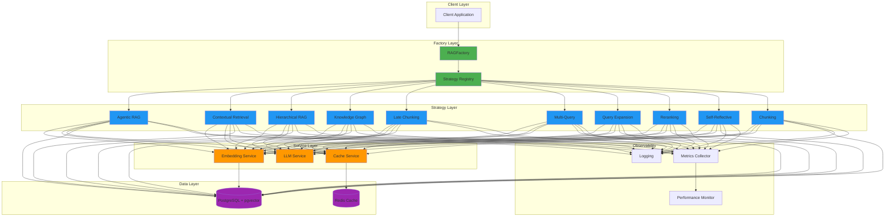
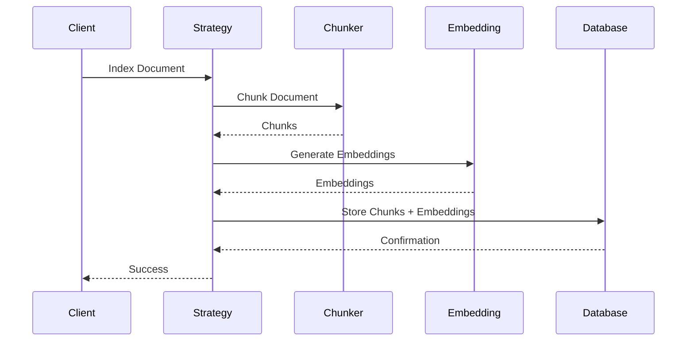
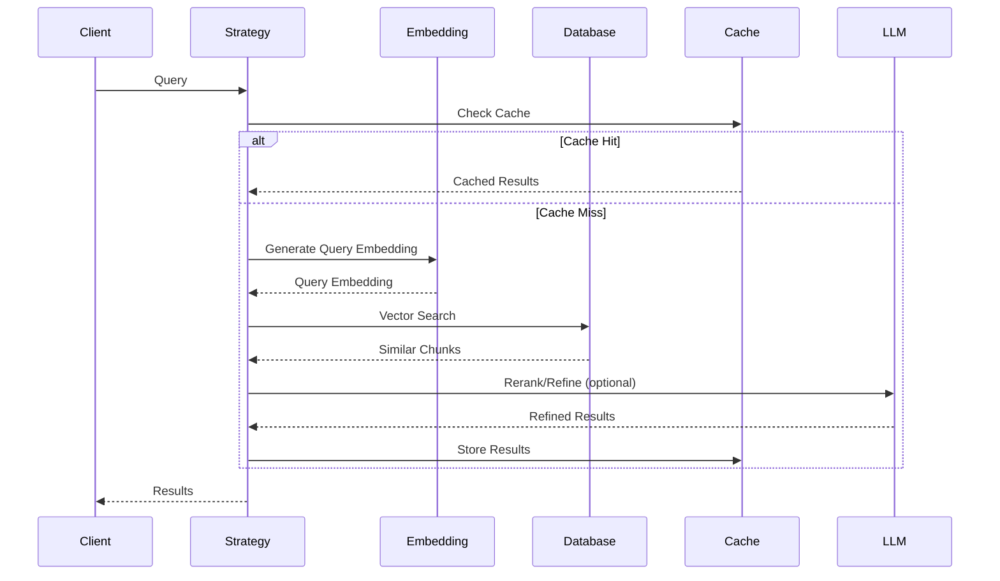

# Architecture Overview

This document provides a high-level overview of the RAG Factory system architecture.

---

## System Architecture

RAG Factory is built on a modular, extensible architecture using the Factory and Strategy design patterns:



---

## Core Components

### 1. RAGFactory

The central factory class responsible for:

- **Strategy Registration**: Maintaining a registry of available strategies
- **Strategy Creation**: Instantiating strategies with configuration
- **Dependency Injection**: Providing shared services to strategies
- **Configuration Management**: Loading and validating configurations

### 2. Strategy Layer

10 production-ready RAG strategies implementing the `IRAGStrategy` interface:

| Strategy | Purpose |
|----------|---------|
| **Agentic RAG** | LLM agents dynamically select retrieval tools |
| **Chunking** | Intelligent document chunking |
| **Contextual Retrieval** | Add context to chunks before embedding |
| **Hierarchical RAG** | Multi-level document hierarchy |
| **Knowledge Graph** | Graph-based entity extraction |
| **Late Chunking** | Embed documents before chunking |
| **Multi-Query** | Generate multiple query variants |
| **Query Expansion** | Expand queries with related terms |
| **Reranking** | Re-score results with cross-encoder |
| **Self-Reflective** | Iterative query refinement |

### 3. Service Layer

Shared services used by strategies:

- **Embedding Service**: Generate text embeddings using various models
- **LLM Service**: Interface to language models (OpenAI, Anthropic, etc.)
- **Cache Service**: Redis-based caching for performance

### 4. Data Layer

- **PostgreSQL with pgvector**: Vector database for similarity search
- **Redis**: Caching layer for embeddings and results
- **Alembic**: Database migrations

### 5. Observability

- **Logging**: Structured logging with configurable levels
- **Metrics**: Performance metrics collection
- **Cost Tracking**: LLM API cost monitoring
- **Performance Monitoring**: Query latency and throughput tracking

---

## Technology Stack

### Core Technologies

| Component | Technology | Purpose |
|-----------|-----------|---------|
| **Language** | Python 3.8+ | Core implementation |
| **Database** | PostgreSQL 12+ | Data storage |
| **Vector Search** | pgvector | Similarity search |
| **Cache** | Redis | Performance optimization |
| **Embeddings** | Sentence-Transformers | Text embeddings |
| **LLM** | OpenAI/Anthropic APIs | Language models |
| **ORM** | SQLAlchemy | Database abstraction |
| **Migrations** | Alembic | Schema management |

### Development Tools

| Tool | Purpose |
|------|---------|
| **pytest** | Testing framework |
| **black** | Code formatting |
| **mypy** | Type checking |
| **flake8** | Linting |
| **MkDocs** | Documentation |

---

## Design Principles

### 1. Modularity

Each strategy is self-contained and can be used independently or combined in pipelines.

### 2. Extensibility

New strategies can be added by implementing the `IRAGStrategy` interface and registering with the factory.

### 3. Configuration-Driven

All strategies are configurable via Python dictionaries, YAML files, or environment variables.

### 4. Performance-First

Built-in caching, batch processing, and database optimization for production workloads.

### 5. Observability

Comprehensive logging, metrics, and monitoring for production deployments.

---

## Scalability Considerations

### Horizontal Scaling

- **Stateless Design**: Strategies are stateless and can run on multiple instances
- **Database Connection Pooling**: Efficient connection management
- **Redis Caching**: Distributed caching across instances

### Vertical Scaling

- **Batch Processing**: Process multiple queries/documents in batches
- **GPU Support**: CUDA acceleration for embeddings
- **ONNX Optimization**: Faster inference with ONNX models

### Performance Optimization

- **Vector Indexing**: Optimized pgvector indexes for fast similarity search
- **Query Caching**: Cache frequent queries and embeddings
- **Lazy Loading**: Load models and data only when needed

---

## Data Flow

### Document Indexing Flow



### Query Execution Flow



---

## Extension Points

RAG Factory provides several extension points:

### 1. Custom Strategies

Implement `IRAGStrategy` to create custom retrieval strategies:

```python
from rag_factory.strategies.base import IRAGStrategy

class MyCustomStrategy(IRAGStrategy):
    def retrieve(self, query: str, **kwargs):
        # Your custom retrieval logic
        pass
```

### 2. Custom Embedding Models

Integrate custom embedding models:

```python
from rag_factory.services.embedding_service import EmbeddingService

class CustomEmbeddingService(EmbeddingService):
    def embed_text(self, text: str):
        # Your custom embedding logic
        pass
```

### 3. Custom LLM Providers

Add support for new LLM providers:

```python
from rag_factory.services.llm_service import LLMService

class CustomLLMService(LLMService):
    def generate(self, prompt: str, **kwargs):
        # Your custom LLM logic
        pass
```

---

## Security Considerations

- **API Key Management**: Use environment variables for sensitive credentials
- **Database Security**: Use SSL/TLS for database connections
- **Input Validation**: Validate all user inputs to prevent injection attacks
- **Access Control**: Implement authentication and authorization as needed

---

## Next Steps

- **[Design Patterns](design-patterns.md)** - Deep dive into design patterns
- **<!-- BROKEN LINK: Data Flow <!-- (broken link to: data-flow.md) --> --> Data Flow** - Detailed data flow diagrams
- **<!-- BROKEN LINK: Components <!-- (broken link to: components.md) --> --> Components** - Component-level documentation

---

## See Also

- [Strategy Selection Guide](../guides/strategy-selection.md)
- <!-- BROKEN LINK: Configuration Reference <!-- (broken link to: ../guides/configuration-reference.md) --> --> Configuration Reference
- <!-- BROKEN LINK: Best Practices <!-- (broken link to: ../guides/best-practices.md) --> --> Best Practices
