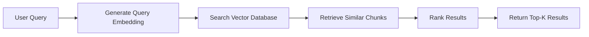

# Your First Query

This guide provides a detailed walkthrough of performing your first query with RAG Factory.

---

## Prerequisites

Before starting, ensure you have:

- ✅ Installed RAG Factory ([Installation Guide](installation.md))
- ✅ Set up your database connection
- ✅ Indexed at least one document

If you haven't completed these steps, follow the [Quick Start Guide](quick-start.md) first.

---

## Understanding the Query Process

A typical RAG query involves these steps:



---

## Basic Query

### Step 1: Prepare Your Query

```python
query = "What is machine learning?"
```

### Step 2: Generate Query Embedding

```python
from rag_factory.services.embedding_service import EmbeddingService

embedding_service = EmbeddingService(
    model_name="sentence-transformers/all-MiniLM-L6-v2"
)

query_embedding = embedding_service.embed_text(query)
```

### Step 3: Search for Similar Chunks

```python
from rag_factory.repositories.chunk import ChunkRepository
from rag_factory.database.connection import get_connection

conn = get_connection()
chunk_repo = ChunkRepository(conn)

results = chunk_repo.search_similar(
    query_embedding=query_embedding,
    top_k=5,
    similarity_threshold=0.5
)
```

### Step 4: Process Results

```python
print(f"Found {len(results)} results for: {query}\n")

for i, result in enumerate(results, 1):
    print(f"Result {i}:")
    print(f"  Score: {result.score:.4f}")
    print(f"  Content: {result.content[:200]}...")
    print(f"  Document ID: {result.document_id}")
    print(f"  Metadata: {result.metadata}\n")
```

---

## Using a Strategy

Strategies provide higher-level abstractions for querying. Here's how to use different strategies:

### Contextual Retrieval

```python
from rag_factory.strategies.contextual.strategy import ContextualRetrievalStrategy
from rag_factory.strategies.contextual.config import ContextualRetrievalConfig

# Configure strategy
config = ContextualRetrievalConfig(
    chunk_size=512,
    top_k=5,
    context_window=1
)

# Create strategy
strategy = ContextualRetrievalStrategy(config)

# Perform retrieval
results = strategy.retrieve(query="What is machine learning?")

# Results include context from surrounding chunks
for result in results:
    print(f"Content: {result.content}")
    print(f"Context: {result.context}\n")
```

### Multi-Query Strategy

Generate multiple query variants for better coverage:

```python
from rag_factory.strategies.multi_query.strategy import MultiQueryRAGStrategy
from rag_factory.strategies.multi_query.config import MultiQueryConfig

config = MultiQueryConfig(
    num_variants=3,
    top_k=5,
    ranking_strategy="reciprocal_rank_fusion"
)

strategy = MultiQueryRAGStrategy(config)
results = strategy.retrieve(query="What is machine learning?")

# Results are deduplicated and ranked across all query variants
```

### Reranking Strategy

Improve precision with cross-encoder reranking:

```python
from rag_factory.strategies.reranking.strategy import RerankingStrategy
from rag_factory.strategies.reranking.config import RerankingConfig

config = RerankingConfig(
    initial_top_k=20,
    final_top_k=5,
    reranker_model="cross-encoder/ms-marco-MiniLM-L-6-v2"
)

strategy = RerankingStrategy(config)
results = strategy.retrieve(query="What is machine learning?")

# Results are reranked for better precision
```

---

## Understanding Query Results

Each result typically contains:

| Field | Description |
|-------|-------------|
| `content` | The text content of the chunk |
| `score` | Similarity score (0-1, higher is better) |
| `document_id` | ID of the source document |
| `chunk_index` | Position of chunk in document |
| `metadata` | Additional metadata (source, tags, etc.) |
| `embedding` | Vector embedding (if requested) |

---

## Filtering Results

### By Metadata

```python
results = chunk_repo.search_similar(
    query_embedding=query_embedding,
    top_k=10,
    metadata_filter={"source": "documentation", "topic": "ml"}
)
```

### By Similarity Threshold

```python
results = chunk_repo.search_similar(
    query_embedding=query_embedding,
    top_k=10,
    similarity_threshold=0.7  # Only return results with score >= 0.7
)
```

### By Document

```python
results = chunk_repo.search_similar(
    query_embedding=query_embedding,
    top_k=5,
    document_ids=[doc_id_1, doc_id_2]  # Only search in specific documents
)
```

---

## Query Optimization Tips

### 1. Choose the Right top_k

```python
# Too few: May miss relevant results
top_k = 3  # Use for focused queries

# Balanced: Good for most cases
top_k = 5-10  # Recommended default

# Too many: May include irrelevant results
top_k = 50  # Use only when needed
```

### 2. Use Appropriate Similarity Thresholds

```python
# Strict: High precision, may miss some results
similarity_threshold = 0.8

# Balanced: Good default
similarity_threshold = 0.5-0.7

# Permissive: High recall, may include noise
similarity_threshold = 0.3
```

### 3. Leverage Metadata Filtering

```python
# Narrow search space for faster queries
results = chunk_repo.search_similar(
    query_embedding=query_embedding,
    top_k=5,
    metadata_filter={
        "category": "technical",
        "date_range": "2024"
    }
)
```

---

## Common Query Patterns

### Question Answering

```python
query = "What is the capital of France?"
results = strategy.retrieve(query, top_k=3)

# Use top result for answer
answer_chunk = results[0]
print(f"Answer: {answer_chunk.content}")
```

### Document Search

```python
query = "machine learning algorithms"
results = strategy.retrieve(query, top_k=10)

# Group by document
from collections import defaultdict
docs = defaultdict(list)
for result in results:
    docs[result.document_id].append(result)
```

### Semantic Search

```python
query = "How do neural networks learn?"
results = strategy.retrieve(query, top_k=5)

# Results are semantically similar, not just keyword matches
```

---

## Next Steps

Now that you understand basic querying, explore:

- **[Strategy Selection Guide](../guides/strategy-selection.md)** - Choose the right strategy
- **<!-- BROKEN LINK: Pipeline Setup <!-- (broken link to: ../tutorials/pipeline-setup.md) --> --> Pipeline Setup** - Combine multiple strategies
- **<!-- BROKEN LINK: Performance Optimization <!-- (broken link to: ../tutorials/performance-optimization.md) --> --> Performance Optimization** - Optimize query performance

---

## Troubleshooting

**No results returned**

- Check if documents are indexed
- Lower similarity threshold
- Verify embedding model is the same for indexing and querying

**Poor result quality**

- Try different strategies (e.g., reranking, multi-query)
- Adjust chunk size during indexing
- Use metadata filtering to narrow search

**Slow queries**

- Add database indexes
- Reduce top_k
- Use metadata filtering
- Enable caching

See the <!-- BROKEN LINK: Troubleshooting Guide <!-- (broken link to: ../troubleshooting/performance-issues.md) --> --> Troubleshooting Guide for more help.
