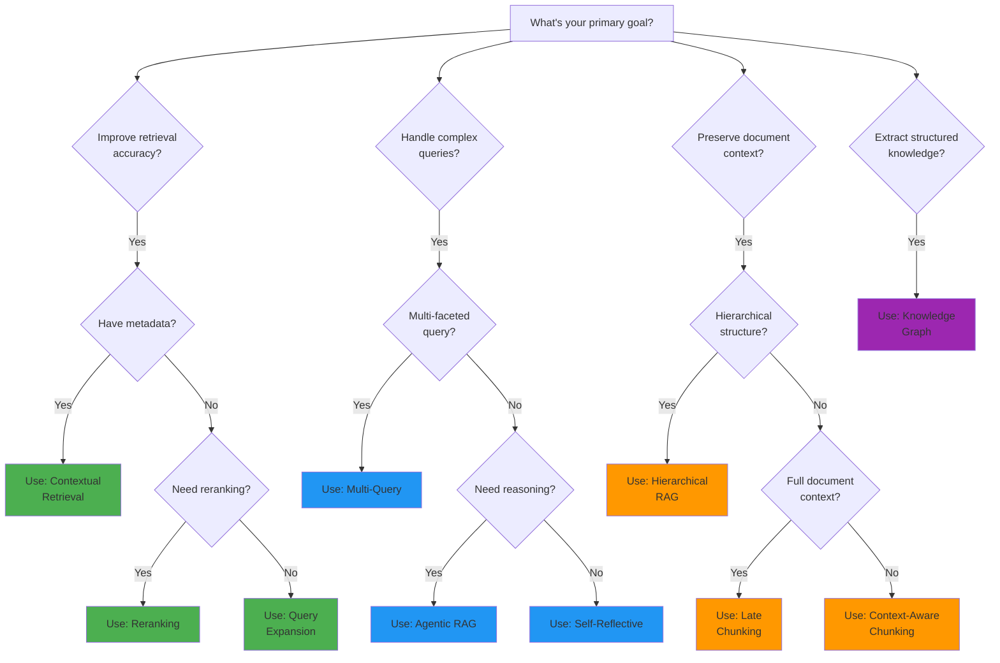
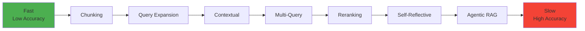

# Strategy Selection Guide

Choose the right RAG strategy for your use case with this comprehensive guide.

---

## Decision Tree

Use this decision tree to quickly identify the best strategy for your needs:



---

## Strategy Comparison Matrix

| Strategy | Accuracy | Speed | Complexity | Use Case | Best For |
|----------|----------|-------|------------|----------|----------|
| **Agentic RAG** | ⭐⭐⭐⭐⭐ | ⭐⭐ | ⭐⭐⭐⭐⭐ | Complex multi-step queries | Research, analysis |
| **Chunking** | ⭐⭐⭐ | ⭐⭐⭐⭐⭐ | ⭐⭐ | Basic document splitting | Simple retrieval |
| **Contextual** | ⭐⭐⭐⭐ | ⭐⭐⭐ | ⭐⭐⭐ | Improving chunk context | General purpose |
| **Hierarchical** | ⭐⭐⭐⭐ | ⭐⭐⭐ | ⭐⭐⭐⭐ | Structured documents | Documentation |
| **Knowledge Graph** | ⭐⭐⭐⭐⭐ | ⭐⭐ | ⭐⭐⭐⭐⭐ | Entity relationships | Domain knowledge |
| **Late Chunking** | ⭐⭐⭐⭐ | ⭐⭐ | ⭐⭐⭐ | Full context preservation | Long documents |
| **Multi-Query** | ⭐⭐⭐⭐ | ⭐⭐⭐ | ⭐⭐⭐ | Ambiguous queries | Q&A systems |
| **Query Expansion** | ⭐⭐⭐⭐ | ⭐⭐⭐⭐ | ⭐⭐ | Improving recall | Search engines |
| **Reranking** | ⭐⭐⭐⭐⭐ | ⭐⭐ | ⭐⭐⭐ | Improving precision | High-quality results |
| **Self-Reflective** | ⭐⭐⭐⭐ | ⭐⭐ | ⭐⭐⭐⭐ | Iterative refinement | Complex information needs |

**Legend**: ⭐ = Low, ⭐⭐⭐ = Medium, ⭐⭐⭐⭐⭐ = High

---

## Recommended Combinations

### 1. High-Accuracy Q&A System

**Goal**: Maximum answer accuracy for question-answering

**Pipeline**:
```python
pipeline = StrategyPipeline([
    MultiQueryStrategy(config),      # Generate query variants
    ContextualRetrievalStrategy(config),  # Add context
    RerankingStrategy(config)        # Rerank for precision
])
```

**Why**: Multi-query improves recall, contextual adds context, reranking ensures precision.

---

### 2. Fast General-Purpose Retrieval

**Goal**: Quick retrieval with good accuracy

**Pipeline**:
```python
pipeline = StrategyPipeline([
    QueryExpansionStrategy(config),  # Expand query terms
    ChunkingStrategy(config)         # Simple chunking
])
```

**Why**: Query expansion improves recall without heavy computation.

---

### 3. Complex Research Assistant

**Goal**: Handle complex, multi-faceted research queries

**Pipeline**:
```python
pipeline = StrategyPipeline([
    AgenticRAGStrategy(config),      # Agent-based tool selection
    SelfReflectiveStrategy(config),  # Iterative refinement
    RerankingStrategy(config)        # Final precision boost
])
```

**Why**: Agentic RAG handles complexity, self-reflection refines results, reranking ensures quality.

---

### 4. Document-Centric Retrieval

**Goal**: Preserve document structure and context

**Pipeline**:
```python
pipeline = StrategyPipeline([
    HierarchicalRAGStrategy(config), # Preserve hierarchy
    ContextualRetrievalStrategy(config)  # Add context
])
```

**Why**: Hierarchical structure maintained, context preserved.

---

### 5. Knowledge Extraction

**Goal**: Extract and query structured knowledge

**Strategy**:
```python
strategy = KnowledgeGraphStrategy(config)
```

**Why**: Knowledge graphs excel at entity relationships and structured knowledge.

---

## Strategy Compatibility Matrix

Which strategies work well together?

|  | Agentic | Chunking | Contextual | Hierarchical | KG | Late | Multi-Q | Expansion | Rerank | Self-Ref |
|---|---------|----------|------------|--------------|----|----- |---------|-----------|--------|----------|
| **Agentic** | - | ✅ | ✅ | ✅ | ✅ | ✅ | ⚠️ | ✅ | ✅ | ✅ |
| **Chunking** | ✅ | - | ✅ | ⚠️ | ✅ | ⚠️ | ✅ | ✅ | ✅ | ✅ |
| **Contextual** | ✅ | ✅ | - | ✅ | ✅ | ✅ | ✅ | ✅ | ✅ | ✅ |
| **Hierarchical** | ✅ | ⚠️ | ✅ | - | ✅ | ⚠️ | ✅ | ✅ | ✅ | ✅ |
| **KG** | ✅ | ✅ | ✅ | ✅ | - | ✅ | ✅ | ✅ | ✅ | ✅ |
| **Late Chunking** | ✅ | ⚠️ | ✅ | ⚠️ | ✅ | - | ✅ | ✅ | ✅ | ✅ |
| **Multi-Query** | ⚠️ | ✅ | ✅ | ✅ | ✅ | ✅ | - | ⚠️ | ✅ | ⚠️ |
| **Query Expansion** | ✅ | ✅ | ✅ | ✅ | ✅ | ✅ | ⚠️ | - | ✅ | ✅ |
| **Reranking** | ✅ | ✅ | ✅ | ✅ | ✅ | ✅ | ✅ | ✅ | - | ✅ |
| **Self-Reflective** | ✅ | ✅ | ✅ | ✅ | ✅ | ✅ | ⚠️ | ✅ | ✅ | - |

**Legend**: ✅ = Compatible, ⚠️ = Use with caution (may be redundant or conflict)

---

## Performance Trade-offs

### Latency vs Accuracy



### Cost vs Quality

| Strategy | LLM Calls | Embedding Calls | Cost | Quality |
|----------|-----------|-----------------|------|---------|
| Chunking | 0 | Low | $ | ⭐⭐⭐ |
| Query Expansion | 1 | Medium | $$ | ⭐⭐⭐⭐ |
| Contextual | 1 per chunk | High | $$$ | ⭐⭐⭐⭐ |
| Multi-Query | 1 | High | $$$ | ⭐⭐⭐⭐ |
| Reranking | 0 | High | $$ | ⭐⭐⭐⭐⭐ |
| Self-Reflective | Multiple | High | $$$$ | ⭐⭐⭐⭐ |
| Agentic RAG | Multiple | High | $$$$$ | ⭐⭐⭐⭐⭐ |
| Knowledge Graph | High | Medium | $$$$ | ⭐⭐⭐⭐⭐ |
| Hierarchical | 0 | Medium | $$ | ⭐⭐⭐⭐ |
| Late Chunking | 0 | High | $$$ | ⭐⭐⭐⭐ |

---

## Use Case Mapping

### Question Answering

**Recommended**: Multi-Query + Reranking

```python
config = {
    "multi_query": {"num_variants": 3},
    "reranking": {"reranker_model": "cross-encoder/ms-marco-MiniLM-L-6-v2"}
}
```

### Document Search

**Recommended**: Query Expansion + Contextual

```python
config = {
    "query_expansion": {"expansion_method": "semantic"},
    "contextual": {"context_window": 2}
}
```

### Research Assistant

**Recommended**: Agentic RAG + Self-Reflective

```python
config = {
    "agentic": {"tools": ["semantic_search", "metadata_search"]},
    "self_reflective": {"max_iterations": 3}
}
```

### Knowledge Base

**Recommended**: Knowledge Graph

```python
config = {
    "knowledge_graph": {
        "entity_extraction": True,
        "relationship_extraction": True
    }
}
```

### Technical Documentation

**Recommended**: Hierarchical RAG + Contextual

```python
config = {
    "hierarchical": {"levels": ["document", "section", "paragraph"]},
    "contextual": {"context_window": 1}
}
```

---

## When to Use Each Strategy

### Agentic RAG
- ✅ Complex, multi-step queries
- ✅ Need for reasoning and tool selection
- ✅ Research and analysis tasks
- ❌ Simple retrieval needs
- ❌ Latency-sensitive applications

### Context-Aware Chunking
- ✅ General-purpose retrieval
- ✅ Balanced performance and accuracy
- ✅ Structured documents
- ❌ Very long documents
- ❌ Unstructured text

### Contextual Retrieval
- ✅ Improving chunk context
- ✅ Better retrieval accuracy
- ✅ General-purpose enhancement
- ❌ Cost-sensitive applications
- ❌ Real-time requirements

### Hierarchical RAG
- ✅ Structured documents (docs, books, articles)
- ✅ Preserving document hierarchy
- ✅ Section-level retrieval
- ❌ Flat, unstructured text
- ❌ Short documents

### Knowledge Graph
- ✅ Entity-centric queries
- ✅ Relationship extraction
- ✅ Domain knowledge
- ❌ Simple text retrieval
- ❌ Limited computational resources

### Late Chunking
- ✅ Long documents
- ✅ Preserving full context
- ✅ Experimental use cases
- ❌ Short documents
- ❌ Real-time indexing

### Multi-Query
- ✅ Ambiguous queries
- ✅ Multi-faceted questions
- ✅ Improving recall
- ❌ Simple, clear queries
- ❌ Latency-sensitive

### Query Expansion
- ✅ Improving recall
- ✅ Handling synonyms
- ✅ Search engines
- ❌ Precision-critical applications
- ❌ Very specific queries

### Reranking
- ✅ Improving precision
- ✅ High-quality results needed
- ✅ Two-stage retrieval
- ❌ Real-time requirements
- ❌ Limited computational resources

### Self-Reflective
- ✅ Complex information needs
- ✅ Iterative refinement
- ✅ Quality over speed
- ❌ Simple queries
- ❌ Cost-sensitive applications

---

## Quick Reference

| If you need... | Use this strategy |
|----------------|-------------------|
| **Maximum accuracy** | Reranking |
| **Fastest retrieval** | Chunking |
| **Best for Q&A** | Multi-Query + Reranking |
| **Handle complexity** | Agentic RAG |
| **Preserve context** | Hierarchical or Late Chunking |
| **Extract knowledge** | Knowledge Graph |
| **Improve recall** | Query Expansion |
| **Iterative refinement** | Self-Reflective |
| **General purpose** | Contextual Retrieval |
| **Structured docs** | Hierarchical RAG |

---

## Next Steps

- [Explore Individual Strategies](../strategies/overview.md)
- <!-- BROKEN LINK: Build a Pipeline <!-- (broken link to: ../tutorials/pipeline-setup.md) --> --> Build a Pipeline
- <!-- BROKEN LINK: Performance Tuning <!-- (broken link to: performance-tuning.md) --> --> Performance Tuning

---

## See Also

- <!-- BROKEN LINK: Configuration Reference <!-- (broken link to: configuration-reference.md) --> --> Configuration Reference
- <!-- BROKEN LINK: Best Practices <!-- (broken link to: best-practices.md) --> --> Best Practices
- <!-- BROKEN LINK: Performance Optimization <!-- (broken link to: ../tutorials/performance-optimization.md) --> --> Performance Optimization
