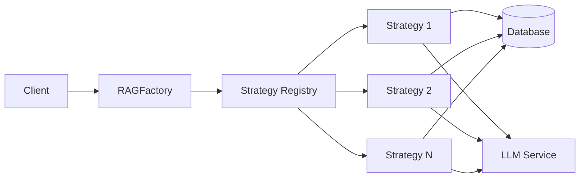

# RAG Factory

**A flexible, extensible factory system for combining multiple Retrieval-Augmented Generation (RAG) strategies**

---

## 🚀 Quick Start

Get started with RAG Factory in under 5 minutes:

```python
from rag_factory.factory import RAGFactory

# Create a factory instance
factory = RAGFactory()

# Create a strategy
config = {"chunk_size": 512, "top_k": 5}
strategy = factory.create_strategy("contextual", config)

# Perform retrieval
results = strategy.retrieve("What is machine learning?")
```

[Get Started →](getting-started/quick-start.md){ .md-button .md-button--primary }
[View Strategies →](strategies/overview.md){ .md-button }

---

## ✨ Features

<div class="grid cards" markdown>

-   :material-factory:{ .lg .middle } __10 RAG Strategies__

    ---

    Choose from 10 production-ready RAG strategies including Contextual Retrieval, Knowledge Graph, Multi-Query, and more.

    [:octicons-arrow-right-24: Explore Strategies](strategies/overview.md)

-   :material-cog:{ .lg .middle } __Flexible Configuration__

    ---

    Configure strategies via Python dictionaries, YAML files, or environment variables.

    [:octicons-arrow-right-24: Configuration Guide](guides/configuration-reference.md)

-   :material-pipe:{ .lg .middle } __Strategy Pipelines__

    ---

    Combine multiple strategies into powerful pipelines for enhanced retrieval performance.

    [:octicons-arrow-right-24: Pipeline Tutorial](tutorials/pipeline-setup.md)

-   :material-speedometer:{ .lg .middle } __Performance Optimized__

    ---

    Built-in caching, batch processing, and performance monitoring for production workloads.

    [:octicons-arrow-right-24: Performance Tuning](guides/performance-tuning.md)

-   :material-database:{ .lg .middle } __PostgreSQL + pgvector__

    ---

    Leverages PostgreSQL with pgvector extension for efficient vector similarity search.

    [:octicons-arrow-right-24: Architecture](architecture/overview.md)

-   :material-chart-line:{ .lg .middle } __Observability Built-in__

    ---

    Comprehensive logging, metrics, and cost tracking for monitoring and optimization.

    [:octicons-arrow-right-24: Best Practices](guides/best-practices.md)

</div>

---

## 📚 Available Strategies

| Strategy | Description | Use Case |
|----------|-------------|----------|
| **Agentic RAG** | LLM agents dynamically select retrieval tools | Complex queries requiring multi-step reasoning |
| **Context-Aware Chunking** | Intelligent document chunking with context | Long documents with hierarchical structure |
| **Contextual Retrieval** | Adds context to chunks before embedding | Improving retrieval accuracy |
| **Hierarchical RAG** | Multi-level document hierarchy | Documents with clear section structure |
| **Knowledge Graph** | Graph-based entity and relationship extraction | Domain knowledge with complex relationships |
| **Late Chunking** | Embed entire documents before chunking | Preserving full document context |
| **Multi-Query** | Generate multiple query variants | Ambiguous or multi-faceted queries |
| **Query Expansion** | Expand queries with related terms | Improving recall |
| **Reranking** | Re-score results with cross-encoder | Improving precision |
| **Self-Reflective** | Iterative query refinement based on results | Complex information needs |

[View Strategy Comparison →](guides/strategy-selection.md)

---

## 🎯 Use Cases

RAG Factory is perfect for:

- **Question Answering Systems**: Build accurate Q&A systems over your documents
- **Document Search**: Semantic search with advanced retrieval strategies
- **Knowledge Management**: Extract and query structured knowledge from unstructured text
- **Research Assistants**: Multi-strategy retrieval for comprehensive research
- **Customer Support**: Intelligent document retrieval for support agents

---

## 🏗️ Architecture

RAG Factory uses the **Factory** and **Strategy** design patterns to provide a clean, extensible architecture:



[Learn More About Architecture →](architecture/overview.md)

---

## 📖 Documentation Sections

<div class="grid cards" markdown>

-   **Getting Started**
    
    Installation, quick start, and basic configuration

-   **Architecture**
    
    System design, patterns, and data flow

-   **Guides**
    
    Strategy selection, configuration, and best practices

-   **Strategies**
    
    Detailed documentation for each RAG strategy

-   **API Reference**
    
    Complete API documentation with examples

-   **Tutorials**
    
    Step-by-step guides for common tasks

-   **Contributing**
    
    How to contribute to RAG Factory

-   **Troubleshooting**
    
    Common issues and solutions

</div>

---

## 🤝 Contributing

We welcome contributions! See our [Contributing Guide](contributing/index.md) to get started.

---

## 📄 License

RAG Factory is released under the MIT License. See the LICENSE file for details.

---

## 🔗 Links

- [GitHub Repository](https://github.com/yourusername/rag-factory)
- [Issue Tracker](https://github.com/yourusername/rag-factory/issues)
- [PyPI Package](https://pypi.org/project/rag-factory/)
