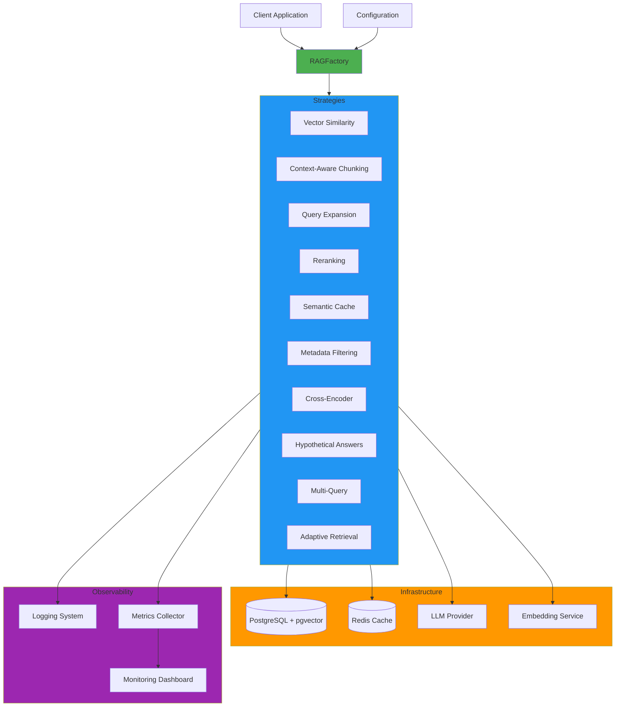
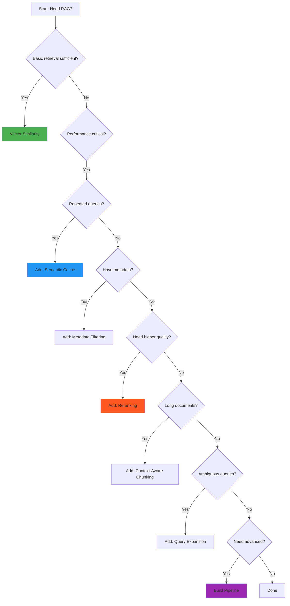

# Story 9.1: Write Developer Documentation

**Story ID:** 9.1
**Epic:** Epic 9 - Documentation & Developer Experience
**Story Points:** 13
**Priority:** High
**Dependencies:** All previous epics (1-8) - complete system needed

---

## User Story

**As a** developer
**I want** comprehensive documentation
**So that** I can understand and extend the RAG factory

---

## Detailed Requirements

### Functional Requirements

1. **Architecture Overview**
   - System architecture diagrams (components, data flow)
   - Design patterns used (Factory, Strategy, Pipeline)
   - Component relationships and dependencies
   - Data flow diagrams for query execution
   - Technology stack overview
   - Scalability considerations

2. **Strategy Selection Guide**
   - Decision tree for choosing strategies
   - Strategy comparison matrix (features, performance, use cases)
   - Recommended combinations for common scenarios
   - Performance trade-offs for each strategy
   - When to use which strategy (use case mapping)
   - Strategy compatibility matrix

3. **Code Examples for Each Strategy**
   - Basic usage example for each of the 10 strategies
   - Configuration options explained
   - Expected inputs and outputs
   - Error handling examples
   - Performance tuning tips
   - Common pitfalls and how to avoid them

4. **Configuration Reference**
   - Complete list of all configuration options
   - Default values and recommended settings
   - Environment variable configuration
   - Database connection configuration
   - LLM provider configuration (OpenAI, Anthropic, etc.)
   - Embedding model configuration
   - Strategy-specific configuration parameters
   - Configuration validation rules

5. **API Reference Documentation**
   - Auto-generated from docstrings (Sphinx or MkDocs)
   - All public classes documented
   - All public methods with parameters, return types, examples
   - Exception documentation
   - Type hints included
   - Cross-references between related classes/methods

6. **Contribution Guidelines**
   - Development environment setup
   - Code style guide (PEP 8, type hints)
   - Git workflow (branches, commits, PRs)
   - How to add a new strategy
   - Testing requirements (unit, integration)
   - Documentation requirements
   - Review process
   - Release process

7. **Troubleshooting Guide**
   - Common error messages and solutions
   - Performance issues and debugging
   - Database connection problems
   - API rate limiting issues
   - Memory issues with large datasets
   - Debugging tips and tools
   - FAQ section
   - Where to get help (GitHub issues, discussions)

### Non-Functional Requirements

1. **Accessibility**
   - Documentation hosted online (ReadTheDocs, GitHub Pages)
   - Search functionality across all docs
   - Mobile-friendly responsive design
   - Fast load times (<2s)
   - Offline documentation available (PDF export)

2. **Maintainability**
   - Documentation source in version control
   - Automated builds on commits
   - Versioned documentation (per release)
   - Broken link checking
   - Automated API reference generation

3. **Completeness**
   - Documentation completeness score >90%
   - All public APIs documented
   - All strategies have examples
   - All configuration options explained
   - Code coverage for documentation (docstrings)

4. **Quality**
   - Clear, concise writing
   - Consistent terminology throughout
   - Grammar and spelling checked
   - Code examples tested and working
   - Diagrams clear and readable

5. **Developer Experience**
   - Time to first working example <30 minutes
   - Easy navigation between related topics
   - Progressive disclosure (beginner → advanced)
   - Copy-paste ready code examples
   - Dark mode support

---

## Acceptance Criteria

### AC1: Architecture Documentation
- [ ] System architecture diagram created (components, relationships)
- [ ] Data flow diagram for query execution
- [ ] Design patterns documented (Factory, Strategy, Pipeline)
- [ ] Technology stack overview written
- [ ] Component interaction diagrams created
- [ ] Scalability architecture documented

### AC2: Strategy Selection Guide
- [ ] Decision tree for strategy selection created
- [ ] Strategy comparison matrix completed (all 10 strategies)
- [ ] Recommended combinations documented (3+ scenarios)
- [ ] Performance comparison data included
- [ ] Use case mapping table created
- [ ] Strategy compatibility matrix documented

### AC3: Strategy Documentation
- [ ] All 10 strategies documented with:
  - [ ] Description and purpose
  - [ ] Basic usage example
  - [ ] Configuration options
  - [ ] Input/output formats
  - [ ] Performance characteristics
  - [ ] Common pitfalls
- [ ] Error handling examples for each strategy
- [ ] Performance tuning tips provided

### AC4: Configuration Reference
- [ ] All configuration options documented
- [ ] Default values listed
- [ ] Environment variable configuration guide
- [ ] Database configuration examples
- [ ] LLM provider configuration (OpenAI, Anthropic)
- [ ] Embedding configuration options
- [ ] Strategy-specific parameters documented
- [ ] Configuration validation rules explained

### AC5: API Reference
- [ ] API documentation auto-generated from docstrings
- [ ] All public classes documented
- [ ] All public methods documented with:
  - [ ] Parameters and types
  - [ ] Return types
  - [ ] Usage examples
  - [ ] Exceptions raised
- [ ] Cross-references between related classes
- [ ] Type hints included in documentation

### AC6: Contribution Guidelines
- [ ] Development environment setup guide
- [ ] Code style guide written (PEP 8, type hints)
- [ ] Git workflow documented
- [ ] "Adding a new strategy" guide created
- [ ] Testing requirements documented
- [ ] Documentation requirements explained
- [ ] PR review process documented

### AC7: Troubleshooting Guide
- [ ] Common errors documented (10+ scenarios)
- [ ] Performance debugging guide written
- [ ] Database troubleshooting section
- [ ] API rate limiting solutions
- [ ] Memory issue debugging guide
- [ ] FAQ section (15+ questions)
- [ ] Support channels documented

### AC8: Documentation Infrastructure
- [ ] Documentation hosted online (accessible URL)
- [ ] Search functionality working
- [ ] Mobile-responsive design
- [ ] Automated builds configured
- [ ] Versioned documentation (per release)
- [ ] PDF export available
- [ ] Dark mode supported

### AC9: Quality Checks
- [ ] Spelling and grammar checked
- [ ] All code examples tested and working
- [ ] Links checked (no broken links)
- [ ] Documentation completeness >90%
- [ ] Consistent terminology throughout
- [ ] All diagrams clear and labeled

---

## Technical Specifications

### Documentation Structure
```
docs/
├── index.md                           # Landing page, quick start
├── README.md                          # GitHub README with badges
│
├── getting-started/
│   ├── installation.md                # Installation instructions
│   ├── quick-start.md                 # 5-minute tutorial
│   ├── configuration.md               # Basic configuration
│   └── first-query.md                 # Your first query
│
├── architecture/
│   ├── overview.md                    # System architecture
│   ├── design-patterns.md             # Factory, Strategy patterns
│   ├── data-flow.md                   # Query execution flow
│   ├── components.md                  # Component details
│   └── diagrams/                      # Mermaid/PlantUML diagrams
│       ├── architecture.mmd
│       ├── data-flow.mmd
│       └── component-interaction.mmd
│
├── guides/
│   ├── strategy-selection.md          # How to choose strategies
│   │   ├── decision-tree.md
│   │   ├── comparison-matrix.md
│   │   └── recommended-combinations.md
│   ├── configuration-reference.md     # Complete config reference
│   ├── performance-tuning.md          # Optimization guide
│   ├── error-handling.md              # Error handling patterns
│   └── best-practices.md              # Best practices
│
├── strategies/
│   ├── overview.md                    # All strategies overview
│   ├── vector-similarity.md           # Each strategy documented
│   ├── context-aware-chunking.md
│   ├── query-expansion.md
│   ├── reranking.md
│   ├── semantic-cache.md
│   ├── metadata-filtering.md
│   ├── cross-encoder.md
│   ├── hypothetical-answers.md
│   ├── multi-query.md
│   └── adaptive-retrieval.md
│
├── api-reference/
│   ├── index.md                       # API overview
│   ├── factory.md                     # RAGFactory class
│   ├── strategies/                    # Each strategy class
│   ├── pipeline.md                    # StrategyPipeline class
│   ├── config.md                      # Configuration classes
│   └── exceptions.md                  # Exception classes
│
├── tutorials/
│   ├── basic-retrieval.md             # Basic tutorial
│   ├── pipeline-setup.md              # Pipeline tutorial
│   ├── custom-strategy.md             # Creating custom strategies
│   ├── performance-optimization.md    # Performance tutorial
│   └── production-deployment.md       # Deployment guide
│
├── examples/
│   ├── simple/                        # Links to code examples
│   ├── medium/
│   ├── advanced/
│   ├── domain-specific/
│   └── integrations/
│
├── contributing/
│   ├── index.md                       # Contribution overview
│   ├── development-setup.md           # Dev environment
│   ├── code-style.md                  # Style guide
│   ├── testing.md                     # Testing guide
│   ├── documentation.md               # Documentation guide
│   ├── adding-strategies.md           # How to add strategies
│   └── release-process.md             # Release workflow
│
├── troubleshooting/
│   ├── common-errors.md               # Common errors & solutions
│   ├── performance-issues.md          # Performance debugging
│   ├── database-issues.md             # Database troubleshooting
│   ├── api-issues.md                  # API troubleshooting
│   └── faq.md                         # Frequently asked questions
│
└── changelog.md                       # Version history
```

### Documentation Tools

**Primary Tool: MkDocs with Material Theme**
```yaml
# mkdocs.yml
site_name: RAG Factory Documentation
site_url: https://rag-factory.readthedocs.io
repo_url: https://github.com/your-org/rag-factory
repo_name: rag-factory

theme:
  name: material
  features:
    - navigation.tabs
    - navigation.sections
    - navigation.expand
    - navigation.top
    - search.suggest
    - search.highlight
    - content.code.copy
    - content.tabs.link
  palette:
    # Light mode
    - scheme: default
      primary: indigo
      accent: indigo
      toggle:
        icon: material/brightness-7
        name: Switch to dark mode
    # Dark mode
    - scheme: slate
      primary: indigo
      accent: indigo
      toggle:
        icon: material/brightness-4
        name: Switch to light mode

plugins:
  - search
  - mkdocstrings:  # Auto-generate API docs from docstrings
      handlers:
        python:
          options:
            docstring_style: google
            show_source: true
            show_root_heading: true
  - mermaid2  # For diagrams
  - pdf-export  # PDF export capability

markdown_extensions:
  - pymdownx.highlight:
      anchor_linenums: true
  - pymdownx.superfences:
      custom_fences:
        - name: mermaid
          class: mermaid
          format: !!python/name:pymdownx.superfences.fence_code_format
  - pymdownx.tabbed:
      alternate_style: true
  - admonition
  - pymdownx.details
  - pymdownx.snippets
  - attr_list
  - md_in_html
  - tables
  - toc:
      permalink: true

nav:
  - Home: index.md
  - Getting Started:
      - Installation: getting-started/installation.md
      - Quick Start: getting-started/quick-start.md
      - Configuration: getting-started/configuration.md
  - Architecture:
      - Overview: architecture/overview.md
      - Design Patterns: architecture/design-patterns.md
      - Data Flow: architecture/data-flow.md
  - Guides:
      - Strategy Selection: guides/strategy-selection.md
      - Configuration Reference: guides/configuration-reference.md
      - Performance Tuning: guides/performance-tuning.md
  - Strategies:
      - Overview: strategies/overview.md
      - Vector Similarity: strategies/vector-similarity.md
      - Context-Aware Chunking: strategies/context-aware-chunking.md
      # ... all strategies
  - API Reference:
      - Overview: api-reference/index.md
      - Factory: api-reference/factory.md
      - Strategies: api-reference/strategies/
  - Examples: examples/
  - Contributing: contributing/
  - Troubleshooting: troubleshooting/
```

### Dependencies
```python
# requirements-docs.txt
mkdocs==1.5.3
mkdocs-material==9.5.3
mkdocstrings[python]==0.24.0
pymdown-extensions==10.7
mkdocs-mermaid2-plugin==1.1.1
mkdocs-pdf-export-plugin==0.5.10
```

### Architecture Diagram Example (Mermaid)
```markdown
# docs/architecture/overview.md

## System Architecture


```

### Strategy Selection Decision Tree
```markdown
# docs/guides/strategy-selection.md

## Strategy Selection Decision Tree


```

### Configuration Reference Example
```markdown
# docs/guides/configuration-reference.md

## Configuration Reference

### Database Configuration

| Parameter | Type | Default | Description |
|-----------|------|---------|-------------|
| `host` | str | `localhost` | Database host |
| `port` | int | `5432` | Database port |
| `database` | str | Required | Database name |
| `user` | str | Required | Database user |
| `password` | str | Required | Database password |
| `pool_size` | int | `10` | Connection pool size |
| `pool_timeout` | int | `30` | Pool timeout (seconds) |

**Example:**
```python
from rag_factory import RAGFactory

config = {
    "db_config": {
        "host": "localhost",
        "port": 5432,
        "database": "ragdb",
        "user": "raguser",
        "password": "secure_password",
        "pool_size": 20
    }
}

factory = RAGFactory(**config)
```

**Environment Variables:**
```bash
export RAG_DB_HOST=localhost
export RAG_DB_PORT=5432
export RAG_DB_NAME=ragdb
export RAG_DB_USER=raguser
export RAG_DB_PASSWORD=secure_password
```
```

### API Reference Generation
```python
# docs/api-reference/factory.md (auto-generated)

# RAGFactory

::: rag_factory.factory.RAGFactory
    options:
      show_source: true
      show_root_heading: true
      heading_level: 2
```

### Contribution Guide Template
```markdown
# docs/contributing/adding-strategies.md

## Adding a New Strategy

This guide walks you through adding a custom retrieval strategy to the RAG Factory.

### Step 1: Create Strategy Class

Create a new file in `rag_factory/strategies/`:

```python
# rag_factory/strategies/my_strategy.py
from typing import List, Dict, Any
from .base import BaseStrategy, RetrievalResult

class MyCustomStrategy(BaseStrategy):
    """
    My custom retrieval strategy.

    This strategy does X by Y to achieve Z.

    Args:
        config: Strategy configuration
        **kwargs: Additional arguments

    Example:
        ```python
        strategy = MyCustomStrategy(config)
        results = strategy.retrieve("query")
        ```
    """

    def __init__(self, config: Dict[str, Any], **kwargs):
        super().__init__(config, **kwargs)
        # Your initialization

    def retrieve(self, query: str, **kwargs) -> List[RetrievalResult]:
        """
        Retrieve documents for a query.

        Args:
            query: Search query
            **kwargs: Additional parameters

        Returns:
            List of retrieval results

        Raises:
            ValueError: If query is invalid
        """
        # Your implementation
        pass
```

### Step 2: Register Strategy

Register in `rag_factory/factory.py`:

```python
from .strategies.my_strategy import MyCustomStrategy

class RAGFactory:
    STRATEGIES = {
        # ... existing strategies
        "my_custom": MyCustomStrategy,
    }
```

### Step 3: Write Tests

Create test file `tests/unit/strategies/test_my_strategy.py`:

```python
import pytest
from rag_factory.strategies.my_strategy import MyCustomStrategy

@pytest.fixture
def strategy():
    config = {"param": "value"}
    return MyCustomStrategy(config)

def test_strategy_initialization(strategy):
    """Test strategy initializes correctly."""
    assert strategy is not None

def test_retrieve(strategy):
    """Test basic retrieval."""
    results = strategy.retrieve("test query")
    assert len(results) > 0
    assert results[0].score >= 0
```

### Step 4: Document Strategy

Add documentation in `docs/strategies/my-strategy.md`

### Step 5: Submit PR

1. Create feature branch: `git checkout -b feature/my-strategy`
2. Commit changes: `git commit -m "Add: My Custom Strategy"`
3. Push: `git push origin feature/my-strategy`
4. Create Pull Request with description
5. Wait for review
```

---

## Unit Tests

### Test File Locations
- `tests/unit/documentation/test_documentation_completeness.py`
- `tests/unit/documentation/test_code_examples.py`
- `tests/unit/documentation/test_links.py`

### Test Cases

#### TC9.1.1: Documentation Completeness Tests
```python
import pytest
import os
from pathlib import Path
import ast
import re

class TestDocumentationCompleteness:
    """Test that all required documentation exists and is complete."""

    @pytest.fixture
    def docs_root(self):
        """Get documentation root directory."""
        return Path(__file__).parent.parent.parent / "docs"

    @pytest.fixture
    def src_root(self):
        """Get source root directory."""
        return Path(__file__).parent.parent.parent / "rag_factory"

    def test_required_doc_files_exist(self, docs_root):
        """Test that all required documentation files exist."""
        required_files = [
            "index.md",
            "getting-started/installation.md",
            "getting-started/quick-start.md",
            "architecture/overview.md",
            "architecture/design-patterns.md",
            "guides/strategy-selection.md",
            "guides/configuration-reference.md",
            "contributing/index.md",
            "troubleshooting/common-errors.md",
            "troubleshooting/faq.md",
        ]

        for file_path in required_files:
            full_path = docs_root / file_path
            assert full_path.exists(), f"Required doc file missing: {file_path}"

    def test_all_strategies_documented(self, docs_root, src_root):
        """Test that all strategies have documentation."""
        # Get all strategy files
        strategy_dir = src_root / "strategies"
        strategy_files = [
            f.stem for f in strategy_dir.glob("*.py")
            if f.stem not in ["__init__", "base"]
        ]

        # Check each has documentation
        doc_dir = docs_root / "strategies"
        for strategy in strategy_files:
            doc_file = doc_dir / f"{strategy.replace('_', '-')}.md"
            assert doc_file.exists(), f"Strategy {strategy} missing documentation"

    def test_all_public_classes_documented(self, src_root):
        """Test that all public classes have docstrings."""
        missing_docs = []

        for py_file in src_root.rglob("*.py"):
            if py_file.stem == "__init__":
                continue

            with open(py_file) as f:
                tree = ast.parse(f.read())

            for node in ast.walk(tree):
                if isinstance(node, ast.ClassDef):
                    # Check if class is public (doesn't start with _)
                    if not node.name.startswith("_"):
                        docstring = ast.get_docstring(node)
                        if not docstring:
                            missing_docs.append(f"{py_file.relative_to(src_root)}::{node.name}")

        assert len(missing_docs) == 0, f"Classes missing docstrings: {missing_docs}"

    def test_all_public_methods_documented(self, src_root):
        """Test that all public methods have docstrings."""
        missing_docs = []

        for py_file in src_root.rglob("*.py"):
            if py_file.stem == "__init__":
                continue

            with open(py_file) as f:
                tree = ast.parse(f.read())

            for node in ast.walk(tree):
                if isinstance(node, ast.ClassDef):
                    for item in node.body:
                        if isinstance(item, ast.FunctionDef):
                            # Check if method is public
                            if not item.name.startswith("_") or item.name == "__init__":
                                docstring = ast.get_docstring(item)
                                if not docstring:
                                    missing_docs.append(
                                        f"{py_file.relative_to(src_root)}::{node.name}.{item.name}"
                                    )

        assert len(missing_docs) == 0, f"Methods missing docstrings: {missing_docs}"

    def test_documentation_completeness_score(self, src_root):
        """Test that documentation completeness score is >90%."""
        total_items = 0
        documented_items = 0

        for py_file in src_root.rglob("*.py"):
            with open(py_file) as f:
                tree = ast.parse(f.read())

            for node in ast.walk(tree):
                if isinstance(node, (ast.ClassDef, ast.FunctionDef)):
                    if not node.name.startswith("_"):
                        total_items += 1
                        if ast.get_docstring(node):
                            documented_items += 1

        completeness = (documented_items / total_items * 100) if total_items > 0 else 0
        assert completeness >= 90, f"Documentation completeness {completeness:.1f}% < 90%"

    def test_mkdocs_config_valid(self, docs_root):
        """Test that mkdocs.yml is valid."""
        import yaml

        mkdocs_path = docs_root.parent / "mkdocs.yml"
        assert mkdocs_path.exists(), "mkdocs.yml missing"

        with open(mkdocs_path) as f:
            config = yaml.safe_load(f)

        assert "site_name" in config
        assert "theme" in config
        assert "nav" in config
        assert config["theme"]["name"] == "material"
```

#### TC9.1.2: Code Examples Tests
```python
import pytest
import re
from pathlib import Path
import subprocess
import tempfile

class TestCodeExamples:
    """Test that all code examples in documentation are valid."""

    @pytest.fixture
    def docs_root(self):
        return Path(__file__).parent.parent.parent / "docs"

    def extract_python_examples(self, md_file: Path):
        """Extract Python code blocks from markdown."""
        with open(md_file) as f:
            content = f.read()

        # Find all ```python code blocks
        pattern = r'```python\n(.*?)```'
        matches = re.findall(pattern, content, re.DOTALL)
        return matches

    def test_all_code_examples_have_syntax(self, docs_root):
        """Test that all Python code examples have valid syntax."""
        errors = []

        for md_file in docs_root.rglob("*.md"):
            examples = self.extract_python_examples(md_file)

            for i, code in enumerate(examples):
                try:
                    compile(code, f"{md_file}:example_{i}", "exec")
                except SyntaxError as e:
                    errors.append(f"{md_file}:example_{i}: {e}")

        assert len(errors) == 0, f"Syntax errors in code examples:\n" + "\n".join(errors)

    def test_strategy_examples_runnable(self, docs_root):
        """Test that strategy examples can be imported."""
        strategy_docs = docs_root / "strategies"

        for doc_file in strategy_docs.glob("*.md"):
            if doc_file.stem == "overview":
                continue

            examples = self.extract_python_examples(doc_file)

            # At least one example per strategy
            assert len(examples) > 0, f"{doc_file.name} has no code examples"

            # First example should include imports
            first_example = examples[0]
            assert "from rag_factory" in first_example or "import" in first_example, \
                f"{doc_file.name} first example missing imports"

    def test_configuration_examples_valid(self, docs_root):
        """Test that configuration examples are valid Python dicts."""
        config_doc = docs_root / "guides" / "configuration-reference.md"

        if not config_doc.exists():
            pytest.skip("Configuration reference not yet created")

        examples = self.extract_python_examples(config_doc)

        for code in examples:
            # Check if it contains config dictionaries
            if "config" in code or "{" in code:
                try:
                    compile(code, "config_example", "exec")
                except SyntaxError as e:
                    pytest.fail(f"Invalid config example: {e}")
```

#### TC9.1.3: Link Tests
```python
import pytest
import re
from pathlib import Path
from urllib.parse import urlparse
import requests

class TestDocumentationLinks:
    """Test that all links in documentation are valid."""

    @pytest.fixture
    def docs_root(self):
        return Path(__file__).parent.parent.parent / "docs"

    def extract_links(self, md_file: Path):
        """Extract all markdown links from file."""
        with open(md_file) as f:
            content = f.read()

        # Find <!-- BROKEN LINK: text <!-- (broken link to: link) --> --> text patterns
        link_pattern = r'\[([^\]]+)\]\(([^\)]+)\)'
        matches = re.findall(link_pattern, content)
        return [(text, link) for text, link in matches]

    def test_no_broken_internal_links(self, docs_root):
        """Test that all internal links are valid."""
        broken_links = []

        for md_file in docs_root.rglob("*.md"):
            links = self.extract_links(md_file)

            for text, link in links:
                # Skip external links
                if link.startswith("http"):
                    continue

                # Skip anchors
                if link.startswith("#"):
                    continue

                # Resolve relative path
                target = (md_file.parent / link).resolve()

                if not target.exists():
                    broken_links.append(f"{md_file.name} -> {link}")

        assert len(broken_links) == 0, \
            f"Broken internal links:\n" + "\n".join(broken_links)

    @pytest.mark.slow
    def test_external_links_valid(self, docs_root):
        """Test that external links are accessible (slow test)."""
        broken_links = []

        for md_file in docs_root.rglob("*.md"):
            links = self.extract_links(md_file)

            for text, link in links:
                # Only check HTTP(S) links
                if not link.startswith("http"):
                    continue

                try:
                    response = requests.head(link, timeout=5, allow_redirects=True)
                    if response.status_code >= 400:
                        broken_links.append(f"{md_file.name} -> {link} (status {response.status_code})")
                except Exception as e:
                    broken_links.append(f"{md_file.name} -> {link} (error: {e})")

        assert len(broken_links) == 0, \
            f"Broken external links:\n" + "\n".join(broken_links)

    def test_all_diagrams_valid(self, docs_root):
        """Test that all mermaid diagrams have valid syntax."""
        errors = []

        for md_file in docs_root.rglob("*.md"):
            with open(md_file) as f:
                content = f.read()

            # Find mermaid diagrams
            pattern = r'```mermaid\n(.*?)```'
            diagrams = re.findall(pattern, content, re.DOTALL)

            for i, diagram in enumerate(diagrams):
                # Basic validation - check for required elements
                if diagram.strip().startswith("graph"):
                    # Graph diagram should have nodes and edges
                    if "-->" not in diagram and "---" not in diagram:
                        errors.append(f"{md_file.name}:diagram_{i} has no edges")

        assert len(errors) == 0, f"Invalid diagrams:\n" + "\n".join(errors)
```

---

## Integration Tests

### Test File Location
`tests/integration/documentation/test_documentation_integration.py`

### Test Scenarios

#### IS9.1.1: Documentation Build Test
```python
import pytest
import subprocess
from pathlib import Path
import shutil

@pytest.mark.integration
class TestDocumentationBuild:
    """Test that documentation builds successfully."""

    @pytest.fixture
    def project_root(self):
        return Path(__file__).parent.parent.parent

    def test_mkdocs_build_succeeds(self, project_root):
        """Test that mkdocs build completes without errors."""
        result = subprocess.run(
            ["mkdocs", "build", "--strict"],
            cwd=project_root,
            capture_output=True,
            text=True
        )

        assert result.returncode == 0, \
            f"mkdocs build failed:\n{result.stderr}"

    def test_mkdocs_serve_starts(self, project_root):
        """Test that mkdocs serve starts (integration test)."""
        import time
        import requests

        # Start mkdocs serve in background
        process = subprocess.Popen(
            ["mkdocs", "serve", "--dev-addr", "localhost:8001"],
            cwd=project_root,
            stdout=subprocess.PIPE,
            stderr=subprocess.PIPE
        )

        try:
            # Wait for server to start
            time.sleep(3)

            # Check if accessible
            response = requests.get("http://localhost:8001")
            assert response.status_code == 200

        finally:
            process.terminate()
            process.wait()

    def test_pdf_export_works(self, project_root):
        """Test that PDF export generates valid PDF."""
        result = subprocess.run(
            ["mkdocs", "build"],
            cwd=project_root,
            capture_output=True
        )

        assert result.returncode == 0

        # Check if PDF was generated
        pdf_path = project_root / "site" / "pdf" / "document.pdf"
        # Note: actual path depends on plugin configuration
        # This is an example - adjust based on your setup

    def test_search_index_generated(self, project_root):
        """Test that search index is generated."""
        # Build docs
        subprocess.run(["mkdocs", "build"], cwd=project_root)

        # Check search index exists
        search_index = project_root / "site" / "search" / "search_index.json"
        assert search_index.exists(), "Search index not generated"

        # Verify it's valid JSON
        import json
        with open(search_index) as f:
            index = json.load(f)

        assert "docs" in index
        assert len(index["docs"]) > 0

@pytest.mark.integration
def test_documentation_time_to_first_example():
    """Test that time to first working example is < 30 minutes."""
    # This is a manual test to be performed by actual users
    # Document the process and timing
    pytest.skip("Manual test: Time a new user going through quick start guide")
```

#### IS9.1.2: API Reference Generation Test
```python
import pytest
import subprocess
from pathlib import Path

@pytest.mark.integration
def test_api_reference_generated():
    """Test that API reference is auto-generated from docstrings."""
    project_root = Path(__file__).parent.parent.parent

    # Build documentation
    result = subprocess.run(
        ["mkdocs", "build"],
        cwd=project_root,
        capture_output=True
    )

    assert result.returncode == 0

    # Check that API reference pages were generated
    api_ref_dir = project_root / "site" / "api-reference"
    assert api_ref_dir.exists(), "API reference not generated"

    # Check for key API pages
    assert (api_ref_dir / "factory" / "index.html").exists()
    assert (api_ref_dir / "strategies" / "index.html").exists()

@pytest.mark.integration
def test_diagrams_rendered():
    """Test that Mermaid diagrams are rendered in build."""
    project_root = Path(__file__).parent.parent.parent

    # Build documentation
    subprocess.run(["mkdocs", "build"], cwd=project_root)

    # Check architecture page
    arch_page = project_root / "site" / "architecture" / "overview" / "index.html"
    assert arch_page.exists()

    with open(arch_page) as f:
        content = f.read()

    # Check if mermaid diagram was rendered
    assert "mermaid" in content.lower() or "svg" in content.lower()
```

---

## Definition of Done

- [ ] All documentation files created per structure
- [ ] Architecture diagrams completed (system, data flow, components)
- [ ] Strategy selection guide with decision tree
- [ ] Strategy comparison matrix completed
- [ ] All 10 strategies documented with examples
- [ ] Configuration reference complete
- [ ] API reference auto-generated from docstrings
- [ ] Contribution guidelines written
- [ ] Troubleshooting guide with 10+ scenarios
- [ ] FAQ with 15+ questions
- [ ] mkdocs.yml configured correctly
- [ ] Documentation builds without errors
- [ ] All internal links working
- [ ] All code examples syntactically correct
- [ ] Documentation hosted online
- [ ] Search functionality working
- [ ] Mobile-responsive
- [ ] Dark mode supported
- [ ] PDF export available
- [ ] Documentation completeness >90%
- [ ] All tests pass
- [ ] Spelling/grammar checked
- [ ] Code reviewed
- [ ] User tested (time to first example <30 min)

---

## Notes for Developers

1. **Start with Structure**: Create all directories and placeholder files first

2. **Write As You Code**: Document each component as you build it in other epics

3. **Use MkDocs Material**: Excellent theme with built-in search, dark mode, and responsive design

4. **Auto-Generate API Docs**: Use mkdocstrings to generate API docs from docstrings - maintains sync

5. **Mermaid Diagrams**: Use Mermaid for diagrams - text-based, version-controllable, renders in browser

6. **Test Code Examples**: Every code example should be tested to ensure it works

7. **Decision Trees**: Visual decision trees help users choose the right strategies

8. **Performance Data**: Include actual performance benchmarks in comparisons

9. **Progressive Disclosure**: Start simple (quick start) then go deeper (advanced guides)

10. **Search is Critical**: Good search makes documentation 10x more useful

11. **Version Docs**: Use versioned documentation so users can reference old versions

12. **Continuous Updates**: Documentation is never "done" - update as code evolves

13. **User Testing**: Have real developers follow your quick start guide and time them

14. **Screenshots**: Include screenshots of dashboard, expected outputs, etc.

15. **Troubleshooting First**: Many users go straight to troubleshooting - make it comprehensive
