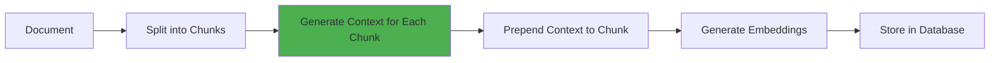

# Contextual Retrieval Strategy

The Contextual Retrieval strategy enhances chunk embeddings by adding contextual information before embedding, significantly improving retrieval accuracy.

---

## Overview

**Purpose**: Add document-level context to chunks before embedding to improve retrieval accuracy

**Complexity**: ⭐⭐⭐ (Medium)  
**Speed**: ⭐⭐⭐ (Medium)  
**Accuracy**: ⭐⭐⭐⭐ (High)

**Best For**:
- General-purpose retrieval enhancement
- Improving chunk context understanding
- Documents where chunks need surrounding context

---

## How It Works



1. **Document Chunking**: Split document into chunks
2. **Context Generation**: Use LLM to generate context for each chunk
3. **Context Prepending**: Add context to chunk before embedding
4. **Embedding**: Generate embeddings with context included
5. **Storage**: Store chunks with enhanced embeddings

---

## Basic Usage

```python
from rag_factory.strategies.contextual.strategy import ContextualRetrievalStrategy
from rag_factory.strategies.contextual.config import ContextualRetrievalConfig

# Configure strategy
config = ContextualRetrievalConfig(
    chunk_size=512,
    chunk_overlap=50,
    context_window=1,
    top_k=5,
    llm_provider="openai",
    llm_model="gpt-3.5-turbo"
)

# Create strategy
strategy = ContextualRetrievalStrategy(config)

# Index a document
document_id = strategy.index_document(
    content="Machine learning is a subset of AI...",
    metadata={"source": "ml_intro"}
)

# Retrieve with context
results = strategy.retrieve(
    query="What is machine learning?",
    top_k=5
)

# Display results
for result in results:
    print(f"Score: {result.score:.4f}")
    print(f"Content: {result.content}")
    print(f"Context: {result.context}\n")
```

---

## Configuration Options

| Parameter | Type | Default | Description |
|-----------|------|---------|-------------|
| `chunk_size` | int | 512 | Size of each chunk in characters |
| `chunk_overlap` | int | 50 | Overlap between chunks |
| `context_window` | int | 1 | Number of surrounding chunks to include |
| `top_k` | int | 5 | Number of results to return |
| `llm_provider` | str | "openai" | LLM provider for context generation |
| `llm_model` | str | "gpt-3.5-turbo" | LLM model to use |
| `use_bm25` | bool | False | Use BM25 for initial retrieval |
| `similarity_threshold` | float | 0.5 | Minimum similarity score |

### Example Configuration

```python
config = ContextualRetrievalConfig(
    chunk_size=512,
    chunk_overlap=50,
    context_window=2,  # Include 2 chunks before and after
    top_k=10,
    llm_provider="openai",
    llm_model="gpt-3.5-turbo",
    use_bm25=True,  # Hybrid search
    similarity_threshold=0.7
)
```

---

## Input/Output Formats

### Input

```python
# Query input
query = "What is machine learning?"

# Optional parameters
kwargs = {
    "top_k": 5,
    "metadata_filter": {"source": "documentation"},
    "similarity_threshold": 0.6
}

results = strategy.retrieve(query, **kwargs)
```

### Output

```python
# List of RetrievalResult objects
[
    RetrievalResult(
        content="Machine learning is a subset of AI...",
        score=0.8523,
        document_id=1,
        chunk_index=0,
        metadata={"source": "ml_intro"},
        context="This document introduces machine learning concepts..."
    ),
    # ... more results
]
```

---

## Performance Characteristics

### Latency
- **Indexing**: Medium (requires LLM calls for context generation)
- **Retrieval**: Fast (standard vector search)

### Cost
- **LLM Calls**: 1 per chunk during indexing
- **Embedding Calls**: 1 per chunk
- **Total Cost**: $$$ (Medium-High due to LLM usage)

### Accuracy
- **Improvement**: 10-30% over basic chunking
- **Best For**: Documents where context is crucial

---

## Common Pitfalls

### 1. Context Window Too Large

**Problem**: Including too many surrounding chunks can dilute relevance

```python
# ❌ Bad: Too large context window
config = ContextualRetrievalConfig(context_window=5)

# ✅ Good: Balanced context window
config = ContextualRetrievalConfig(context_window=1)
```

### 2. Chunk Size Mismatch

**Problem**: Chunks too small or too large for context generation

```python
# ❌ Bad: Very small chunks
config = ContextualRetrievalConfig(chunk_size=100)

# ✅ Good: Appropriate chunk size
config = ContextualRetrievalConfig(chunk_size=512)
```

### 3. Not Caching Context

**Problem**: Regenerating context on every query is expensive

```python
# ✅ Good: Cache generated contexts
strategy = ContextualRetrievalStrategy(config, use_cache=True)
```

---

## Error Handling

### LLM API Errors

```python
from rag_factory.exceptions import LLMError

try:
    results = strategy.retrieve(query)
except LLMError as e:
    print(f"LLM API error: {e}")
    # Fallback to basic retrieval
    results = basic_strategy.retrieve(query)
```

### Rate Limiting

```python
from rag_factory.strategies.contextual.config import ContextualRetrievalConfig

config = ContextualRetrievalConfig(
    llm_provider="openai",
    rate_limit_rpm=60,  # Requests per minute
    retry_on_rate_limit=True
)
```

---

## Performance Tuning

### 1. Batch Context Generation

```python
# Process multiple chunks in parallel
config = ContextualRetrievalConfig(
    batch_size=10,  # Generate context for 10 chunks at once
    parallel_workers=4
)
```

### 2. Use Cheaper LLM for Context

```python
# Use faster/cheaper model for context generation
config = ContextualRetrievalConfig(
    llm_model="gpt-3.5-turbo",  # Instead of gpt-4
    context_generation_temperature=0.3  # Lower temperature for consistency
)
```

### 3. Hybrid Search

```python
# Combine vector search with BM25
config = ContextualRetrievalConfig(
    use_bm25=True,
    bm25_weight=0.3,  # 30% BM25, 70% vector
    vector_weight=0.7
)
```

---

## When to Use

### ✅ Use Contextual Retrieval When:
- Chunks need surrounding context to be understood
- Improving retrieval accuracy is priority
- You have budget for LLM API calls
- Documents have clear narrative flow

### ❌ Don't Use When:
- Real-time indexing is required
- Cost is a major constraint
- Documents are very short
- Chunks are self-contained

---

## Comparison with Other Strategies

| Feature | Contextual | Hierarchical | Late Chunking |
|---------|-----------|--------------|---------------|
| **Context Preservation** | ⭐⭐⭐⭐ | ⭐⭐⭐⭐⭐ | ⭐⭐⭐⭐⭐ |
| **Speed** | ⭐⭐⭐ | ⭐⭐⭐ | ⭐⭐ |
| **Cost** | $$$ | $$ | $$$ |
| **Complexity** | ⭐⭐⭐ | ⭐⭐⭐⭐ | ⭐⭐⭐ |

---

## Examples

### Example 1: Technical Documentation

```python
from rag_factory.strategies.contextual.strategy import ContextualRetrievalStrategy
from rag_factory.strategies.contextual.config import ContextualRetrievalConfig

# Configure for technical docs
config = ContextualRetrievalConfig(
    chunk_size=512,
    context_window=1,
    llm_model="gpt-3.5-turbo"
)

strategy = ContextualRetrievalStrategy(config)

# Index documentation
doc_id = strategy.index_document(
    content=open("api_docs.md").read(),
    metadata={"type": "api_documentation"}
)

# Query
results = strategy.retrieve("How do I authenticate?")
```

### Example 2: Research Papers

```python
# Configure for research papers
config = ContextualRetrievalConfig(
    chunk_size=1024,  # Larger chunks for academic text
    context_window=2,  # More context for complex topics
    llm_model="gpt-4"  # Better model for technical content
)

strategy = ContextualRetrievalStrategy(config)

# Index paper
doc_id = strategy.index_document(
    content=paper_text,
    metadata={"type": "research_paper", "year": 2024}
)
```

---

## Next Steps

- [Strategy Selection Guide](../guides/strategy-selection.md) - Compare with other strategies
- [Pipeline Setup](../tutorials/pipeline-setup.md) - Combine with other strategies
- [Configuration Reference](../guides/configuration-reference.md) - All configuration options

---

## See Also

- [Hierarchical RAG](hierarchical.md) - Alternative for structured documents
- [Multi-Query](multi-query.md) - Combine for better coverage
- [Reranking](reranking.md) - Add for precision boost
